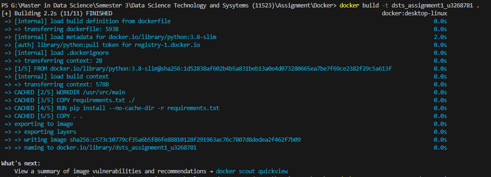

# DSTS Assignment 1 Docker Image - U3268781

This file have list of docker commands I used to push to respository.

### Build Docker Image 

Create a docker account in Docker Hub
I have created docker account with user name gtshen173

#### Docker Login 

    **docker login**
    
provide username and password

    

#### Build the docker image
    
    **docker build -t dsts_assignment1_u3268781 .**

Here Docker image with tag dsts_assignment1_u3268781 is build.

    

#### Run the Docker Image

    **docker run -p 7001:7001 dsts_assignment1_u3268781**

This runs the docker image dsts_assignment1_u3268781 and maps port 7001 of the host machine to port 7001 of the container and will display output. 
    
    

### Uploading the Docker Image to Dockerhub

#### Make sure docker is logged in.

    **docker login**

###check docker images using 

    **docker images**
    
    Here it will show list of docker images with tag and TagID
    

#### Tagging Docker Image

    **docker tag c573c10779cf**

Here docker image of tagid c573c10779cf has been tagged. That tagid is for the dsts_assignment1_u3268781 image I have created.

    

#### Create Repository in Docker Hub

    I have created repository name of gtshen173/dsts_assignment1_u3268781

#### Pushing Image to Dockerhub

    **docker push gtshen173/dsts_assignment1_u3268781**

    

Once it was pushed, then refresh the repository then you will get docker pull command. 

    following is docker pull command you can share to other users to run you models

    **docker pull gtshen173/dsts_assignment1_u3268781**

    

**Docker Repository Link: https://hub.docker.com/r/gtshen173/dsts_assignment1_u3268781**

