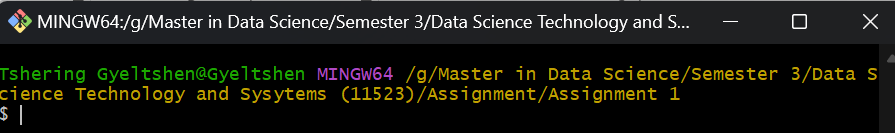
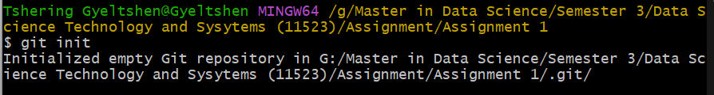
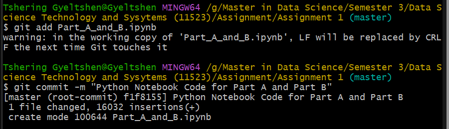
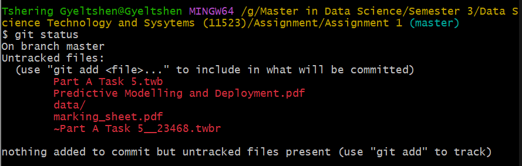
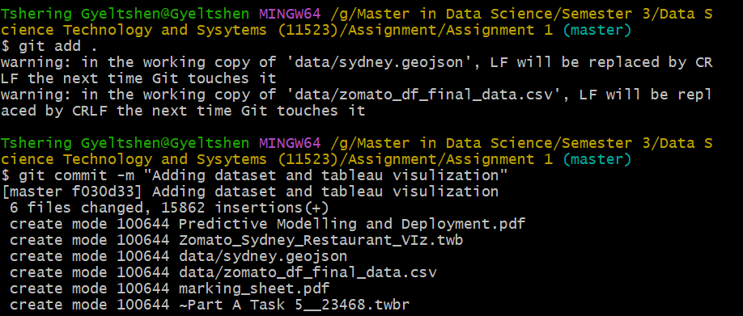
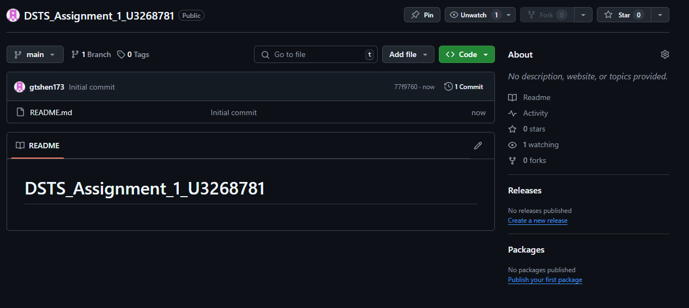
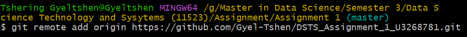
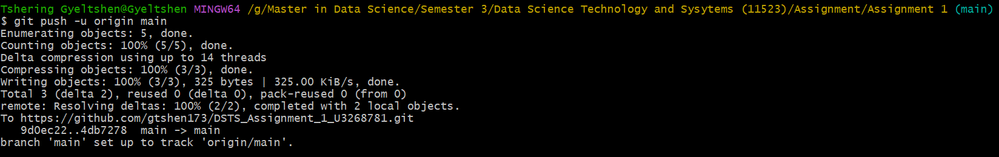
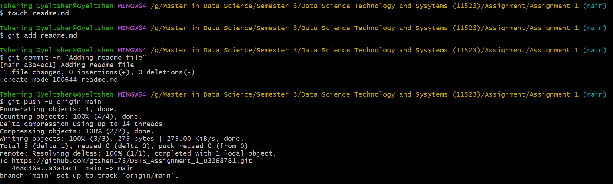

# DSTS Assignment 1 Git COmmands - U3268781

This file have list of git commands I used to push to respository.

### Step 1: Set up Git in your project directory

Open the Git Bash in the folder where project is located

#### Initialize a Git repository:

    **git init**

#### Add and Commit

Add your files to the repository and commit the added files:

Here file Part_A_and_B.ipynb file has been added to repository. 
    **git add Part_A_and_B.ipynb**
    **git commit -m "Python Notebook Code for Part A and Part B"**

#### Check the status:

    **git status**

#### Adding All Files

    **git add .** 
	**git commit -m “message”**

### Step 2: Create a GitHub repository

- Go to GitHub and log into your account.
- Click the “+” icon in the upper-right corner and select “New repository.”
- Name repository (e.g.,DSTS_Assignment_1_U3268781) 
- Click "Create repository."

### Step 3. Connect your local repository to GitHub

- Copy the repository link from the page that appears after creating the repository.
Link: https://github.com/gtshen173/DSTS_Assignment_1_U3268781.git
- In git bash, add the remote repository link:

**git remote add origin https://github.com/gtshen173/DSTS_Assignment_1_U3268781.git**

- Push code to the GitHub repository:

    **git push -u origin main**

### Step 4: Creating readme.md file and pushing to git repository

    **touch readme.md**

 